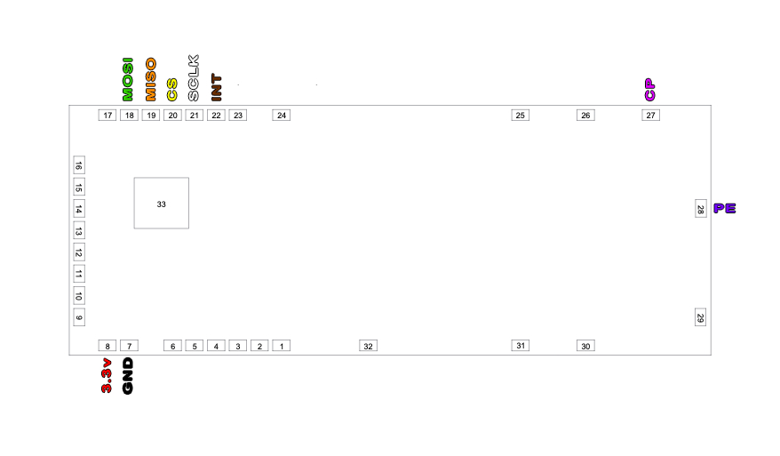
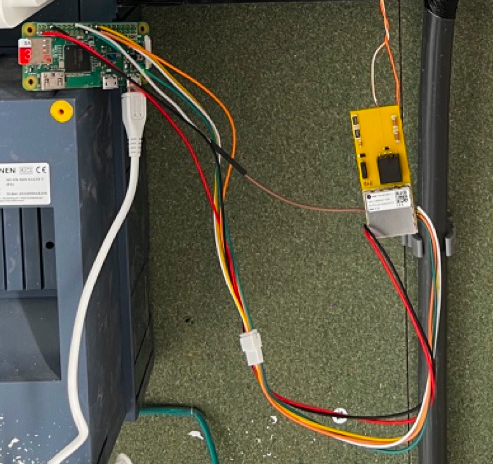

# ESP32-PLC

**Platform:** ESP32-S3

A project utilizing the ESP32-S3 to communicate with a **Qualcomm QCA7005** HomePlug Green PHY modem, primarily to read the State of Charge (SoC) and manage charging parameters of an electric vehicle (EV).

---

## ⚙️ Hardware & Connection Details

### 📌 Pinout and Wiring

Details on connecting the **ESP32-S3 (esp32-s3-n16r8)** to the **QCA7005** modem using the **SPI** interface. All pin assignments are defined in `main.h`.

| ESP32-S3 Function | Pin Definition | ESP32-S3 Pin (GPIO) | QCA7005 Signal | Notes |
| :--- | :--- | :--- | :--- | :--- |
| **Interrupt** | `PIN_QCA700X_INT` | **9** | `INT` | Modem status/event signaling |
| **Chip Select** | `PIN_QCA700X_CS` | **10** | `CS` | SPI Chip Select |
| **MOSI** | `SPI_MOSI` | **11** | `MOSI` | SPI Master Out, Slave In |
| **MISO** | `SPI_MISO` | **12** | `MISO` | SPI Master In, Slave Out |
| **SCK** | `SPI_SCK` | **13** | `SCK` | SPI Clock |
| **Power** | N/A | `3V3` | `VCC` | Power supply for the modem |
| **Ground** | N/A | `GND` | `GND` | Common ground |

*Please consult the project schematics in the `/img` folder for precise wiring and any necessary level-shifting or decoupling components.*

### 🖼️ Connection Diagrams

Here you can find schematics and photos illustrating the connection process, likely using the **Yellow Beet** board setup.

#### Yellow Beet Wiring Diagram

This diagram shows the pin arrangement and wiring scheme on the Yellow Beet board for connecting to the modem and other peripherals.

#### Deployment Example

An example photograph of connected components, showing a typical deployment or testing setup with RPi instead of ESP32.

---

## ✨ Key Features & Functionality

This project implements a comprehensive communication stack, including PLC, IPv6, and application layers, and adds a robust Web Interface for configuration and firmware management.

### 🔌 Core PLC & Communication (HomePlug/ISO 15118)

-   **Modem Communication:** Communicating with the QCA7005 modem (No interrupts used).
-   **SLAC (HomePlug) Protocol:**
    -   Handles key management: `SET_KEY.REQ`, `SET_KEY.CNF`.
    -   Handles SLAC parameters: `CM_SLAC_PARAM.REQ`.
    -   **Attenuation Measurement:** `SOUNDS` are received from the PEV (car), average attenuation level is calculated, and sent back in `CM_ATTEN_CHAR.IND`.
    -   **SLAC Complete:** All Homeplug stuff done.
-   **Networking:**
    -   `SDP` request/response done.
    -   **IPv6 Link-Local:** IPv6 link-local address was generated from ESP's MAC.
    -   We receive the IPv6 address from the car.
-   **Application Layer (V2G/EXI):**
    -   `TCP` connection from the car to the EVSE is set up.
    -   Car starts sending EXI encoded messages over TCP.
    -   First EXI encoded message is decoded, and tells us what charging options the car supports (currently supporting DIN).
    -   **Checkpoint 403:** Schema negotiated.
    -   Up to **'ChargeParameterDiscoveryRequest'** which allows us to read the SoC of the car.

---

## 🌐 Web & Management Interface

The device now includes a full Web Management Interface for easy deployment and maintenance.

### 📶 WiFi Connectivity & Web Server
-   The device operates as a **WiFi Station** and hosts an **Async Web Server** (`ESPAsyncWebServer`) on port 80.
-   Provides configuration access and status information via the local IP address.

### 🔄 Asynchronous Over-The-Air (OTA) Updates
-   Uses **ElegantOTA** in asynchronous mode for reliable, easy, and secure firmware updates via a web browser.
-   Access the update portal at `http://[ESP_IP_ADDRESS]/update`.
-   Includes a **Reboot button** on the root page for easy device restart with confirmation.

### ⚙️ SmartEVSE REST API Integration
-   Implements an **API Endpoint** to communicate the read SoC back to a control system.
-   The `sendSocCallback()` function is utilized to send a POST request with the car's SoC data to a **SmartEVSE-compatible REST endpoint** (e.g., `/api/setSoc`).
-   This enables seamless integration with systems that require real-time charge status.

---

## 🚧 Work in Progress
-   **V2G Negotiation:** Finalizing the V2G sequence up to the actual charging command phase.
-   **Error Handling:** Improving robustness and resilience to communication failures.
